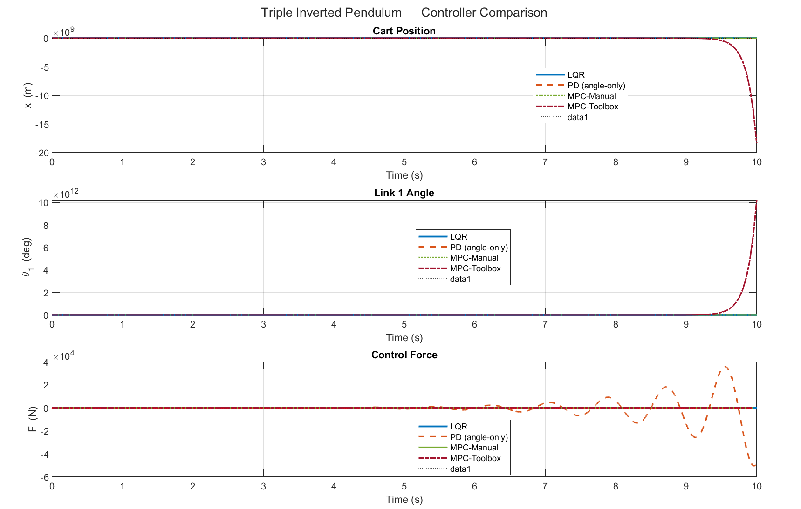
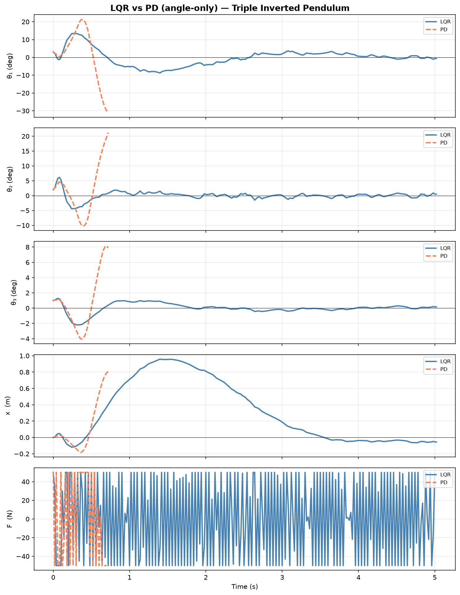
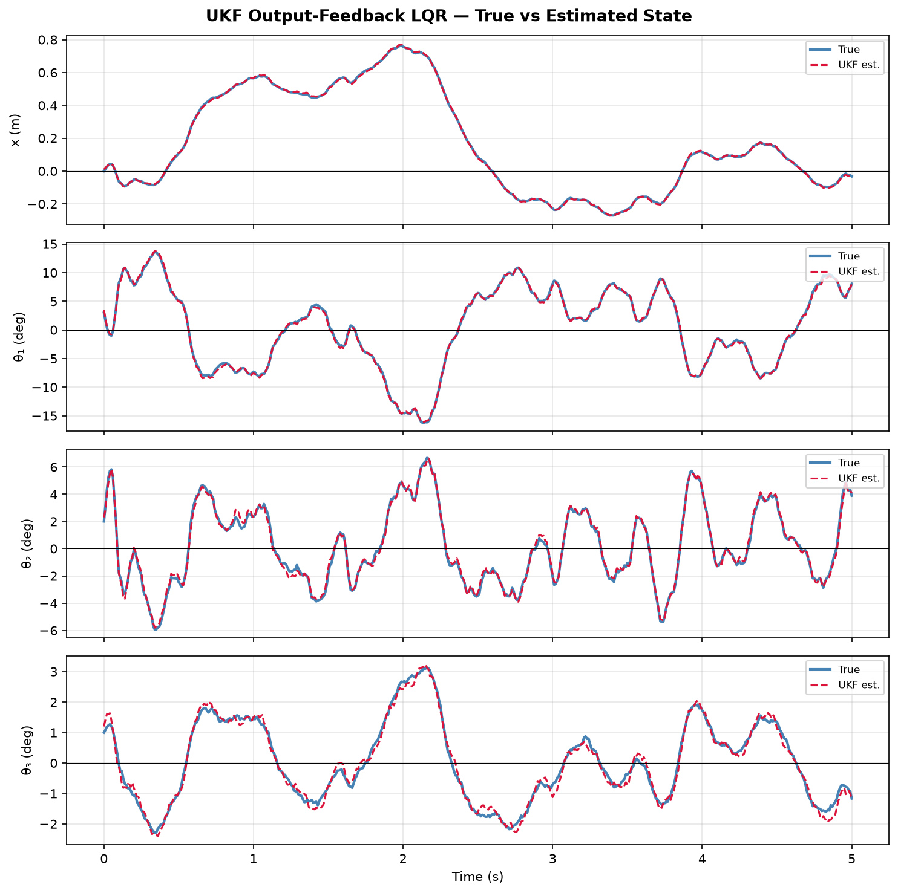

# Triple Inverted Pendulum Control

A dual-language (MATLAB + Python) control systems project implementing the full pipeline for a triple inverted pendulum on a cart — from nonlinear dynamics derivation to classical optimal control, state estimation, model predictive control, and deep reinforcement learning.

The triple inverted pendulum is one of the hardest benchmark problems in control: three unstable links, a single actuator, and eight coupled states that must all be stabilised simultaneously.

---

## What this project covers

| Topic | MATLAB | Python |
|---|---|---|
| Nonlinear equations of motion | ✓ | ✓ |
| Linearisation & state-space | ✓ | ✓ |
| LQR optimal control | ✓ | ✓ |
| PID / angle-only PD control | ✓ | ✓ |
| **MPC (constrained optimisation)** | — | ✓ |
| UKF state estimation | ✓ | ✓ |
| **Deep RL (PPO / SAC)** | — | ✓ |
| Gymnasium environment | — | ✓ |
| Interactive Jupyter notebooks | — | ✓ |

---

## System description

Three rigid links are mounted in series at pivot joints on a cart of mass `M`. A single horizontal force `F` on the cart must balance all three links simultaneously.

**State vector (8 states):**
```
[x, ẋ, θ₁, θ̇₁, θ₂, θ̇₂, θ₃, θ̇₃]
```
- `x` — cart position
- `θ₁` — link 1 absolute angle from vertical
- `θ₂` — link 2 angle relative to link 1
- `θ₃` — link 3 angle relative to link 2

Linearised around the fully upright equilibrium (all angles = 0). Open loop: 3 unstable poles, confirming the fundamental difficulty of the problem.

**Physical parameters** (shared between MATLAB and Python):

| Parameter | Value | Parameter | Value |
|---|---|---|---|
| Cart mass M | 1.0 kg | Link 2 mass m2 | 0.4 kg |
| Link 1 mass m1 | 0.5 kg | Link 3 mass m3 | 0.3 kg |
| Link 1 length l1 | 0.6 m | Link 2 length l2 | 0.5 m |
| Link 3 length l3 | 0.4 m | Gravity g | 9.81 m/s² |

---

## Repository structure

```
inverted-pendulum-control/
│
├── matlab/                          # MATLAB scripts
│   ├── parameters.m                 # Physical constants (source of truth)
│   ├── linearize.m                  # Derives A, B, C, D matrices
│   ├── lqr_design.m                 # LQR gain + controllability check
│   ├── pid_design.m                 # Angle-only PD controller
│   ├── ukf_design.m                 # Unscented Kalman Filter
│   ├── compare_controllers.m        # LQR vs PID comparison plots
│   └── open_loop_sim.m              # Unstable open-loop response
│
├── simulink/                        # Simulink block diagrams
│   ├── lqr_model.slx
│   ├── pid_model.slx
│   └── ukf_model.slx
│
├── python/                          # Python implementation
│   ├── utils/
│   │   ├── parameters.py            # Mirrors matlab/parameters.m exactly
│   │   └── dynamics.py              # Linearised + full nonlinear EOM
│   │
│   ├── controllers/
│   │   ├── base.py                  # Abstract Controller interface
│   │   ├── lqr.py                   # LQR via continuous-time ARE
│   │   ├── pid.py                   # Angle-only PD (matches pid_design.m)
│   │   └── mpc.py                   # MPC via CVXPY / CLARABEL
│   │
│   ├── estimation/
│   │   └── ukf.py                   # Merwe-scaled UKF, ZOH process model
│   │
│   ├── envs/
│   │   └── triple_pendulum_env.py   # Gymnasium environment (RK45 integration)
│   │
│   ├── rl/
│   │   ├── train.py                 # PPO / SAC training (stable-baselines3)
│   │   └── evaluate.py              # Load model and evaluate episodes
│   │
│   └── notebooks/
│       ├── 01_system_dynamics.ipynb # A/B matrices, eigenvalues, mass matrix
│       ├── 02_lqr_vs_pid.ipynb      # LQR vs PD vs MPC comparison
│       ├── 03_ukf_estimation.ipynb  # UKF true vs estimated state plots
│       └── 04_rl_evaluation.ipynb   # PPO agent vs LQR comparison
│
├── results/
│   ├── matlab/                      # MATLAB simulation outputs
│   │   ├── controller_comparison.png
│   │   ├── lqr_stable.gif
│   │   └── open_loop.gif
│   └── python/                      # Python simulation outputs
│       ├── lqr_vs_pd.png
│       ├── lqr_vs_mpc.png
│       └── ukf_estimation.png
│
└── .gitignore
```

---

## Results

### MATLAB — Open loop vs LQR

Without control, a small perturbation causes exponential divergence. LQR stabilises all three links from a 3° initial condition.

| | Open loop | LQR | PID (angle-only) |
|---|---|---|---|
| Stable? | No | **Yes** | Marginal |
| Cart drift | — | Minimal | Large |
| Closed-loop poles | 3 unstable | All LHP | 3 unstable remain |



### Python — LQR vs PD vs MPC

**Notebook 02** runs all three controllers side by side with the nonlinear dynamics (RK45 integration):



**Key MPC result** — with a tight force limit (F_max = 15 N), LQR clips the desired force and loses control within 0.4 s. MPC looks 20 steps ahead (0.4 s horizon), finds the optimal trajectory within the constraint, and stabilises for the full 5 s:

| Controller | F_max = 50 N | F_max = 15 N |
|---|---|---|
| LQR | 5.0 s | **0.4 s** (falls) |
| MPC | 5.0 s | **5.0 s** (stable) |

### Python — UKF state estimation

The UKF recovers all 8 states from noisy measurements of `[x, θ₁, θ₂, θ₃]` only — no velocity sensors needed. Velocity estimation RMSE ≈ 0.074 rad/s.



---

## How to run — MATLAB

**Prerequisites:** MATLAB R2021a+, Control System Toolbox, Statistics and Machine Learning Toolbox

```matlab
run('matlab/parameters.m')          % Load system parameters
run('matlab/linearize.m')           % Compute A, B, C, D
run('matlab/lqr_design.m')          % Design LQR controller
run('matlab/open_loop_sim.m')       % Show unstable open-loop
run('matlab/pid_design.m')          % Angle-only PD controller
run('matlab/ukf_design.m')          % UKF state estimation
run('matlab/compare_controllers.m') % Side-by-side comparison
```

Open Simulink models from `simulink/` for interactive block-diagram simulation.

---

## How to run — Python

**Prerequisites:** Python 3.10+

### 1. Create a virtual environment and install dependencies

```bash
cd inverted-pendulum-control
python -m venv .venv

# Windows
.venv\Scripts\activate
# macOS / Linux
source .venv/bin/activate

pip install numpy scipy matplotlib gymnasium stable-baselines3[extra] cvxpy clarabel filterpy jupyter
```

### 2. Run the Jupyter notebooks

```bash
jupyter notebook python/notebooks/
```

Open in order:
- `01_system_dynamics.ipynb` — verify the linearised model (A/B matrices, eigenvalues)
- `02_lqr_vs_pid.ipynb` — LQR vs angle-only PD vs MPC with constraint demo
- `03_ukf_estimation.ipynb` — UKF state estimation from partial observations
- `04_rl_evaluation.ipynb` — compare trained RL agent against LQR

Each notebook installs its own dependencies on the first cell, so it works regardless of which Python kernel VS Code or Jupyter selects.

### 3. Train and evaluate a reinforcement learning agent

```bash
# Train PPO (runs ~20 min on CPU, saves checkpoints every 50k steps)
python python/rl/train.py --timesteps 1000000 --n_envs 4

# Evaluate the best saved model
python python/rl/evaluate.py --episodes 10
```

Use `--algo sac` to train with SAC instead of PPO. Models are saved to `python/rl/saved_models/`.

> **Note:** The triple pendulum is a hard RL environment. 1M timesteps produces a baseline; 10–50M steps are needed for a competitive policy. Classical controllers (LQR, MPC) dominate by design — the RL experiment demonstrates the gap.

---

## Control theory background

### LQR
Solves the continuous-time algebraic Riccati equation (CARE) to find the gain matrix **K** that minimises:

```
J = ∫₀^∞ (xᵀQx + uᵀRu) dt
```

**Bryson's rule** is used to set Q and R: `Q_ii = 1 / (max_acceptable_i²)`. All 8 closed-loop poles land in the left-half plane, giving guaranteed stability for the linearised system.

### PID (angle-only PD)
The MATLAB `pid_design.m` zeroes the cart-position and cart-velocity terms of the LQR gain, leaving only angle feedback. This mirrors what a practical PID loop on each joint would look like. The result: angles stabilise but the cart drifts, and three unstable poles remain — showing the structural limitation of output-only feedback on an 8-state system.

### MPC
Solves a constrained finite-horizon QP at every timestep using CVXPY + CLARABEL:

```
min  Σ xₖᵀQxₖ + Ruₖ²  +  x_N ᵀ P x_N
s.t. xₖ₊₁ = Ad xₖ + Bd uₖ
     |uₖ|  ≤ F_max          ← hard force constraint
     |xₖ[0]| ≤ x_limit      ← hard cart constraint (optional)
```

The terminal cost **P** is the DARE solution, so the unconstrained MPC solution exactly recovers LQR. The advantage appears when constraints are active: MPC plans the entire horizon within bounds, while LQR clips the instantaneous force and loses anticipation.

Horizon: N = 20 steps (0.4 s lookahead). Typical solve time: 8–15 ms with CLARABEL after warm-up.

### UKF
Uses Merwe-scaled sigma points (α=1e-3, β=2, κ=0) to propagate uncertainty through the ZOH-discretised linear model. Observes only `[x, θ₁, θ₂, θ₃]` — four of the eight states — and recovers all velocities from the dynamics. Process noise Q and measurement noise R are calibrated to match `matlab/ukf_design.m`.

### Reinforcement Learning (PPO / SAC)
The gymnasium environment simulates the nonlinear dynamics with RK45 integration at dt = 0.02 s. Reward = `1 - θ₁² - θ₂² - θ₃² - 0.1x² - 0.001u²`, with a -10 penalty on fall. VecNormalize wraps the observation and reward for training stability. The RL experiment serves as a baseline comparison: classical controllers with full model knowledge outperform model-free RL by a wide margin on this task at reasonable compute budgets.

---

## Tools used

| Tool | Purpose |
|---|---|
| MATLAB + Control System Toolbox | Linearisation, LQR/PID/UKF design |
| Simulink | Block-diagram closed-loop simulation |
| Python / NumPy / SciPy | Nonlinear dynamics, numerical integration |
| CVXPY + CLARABEL | MPC quadratic programme solver |
| Gymnasium | RL training environment |
| Stable-Baselines3 | PPO and SAC implementations |
| filterpy | UKF sigma-point framework |
| Matplotlib | All plots and animations |
| Jupyter | Interactive notebooks |
